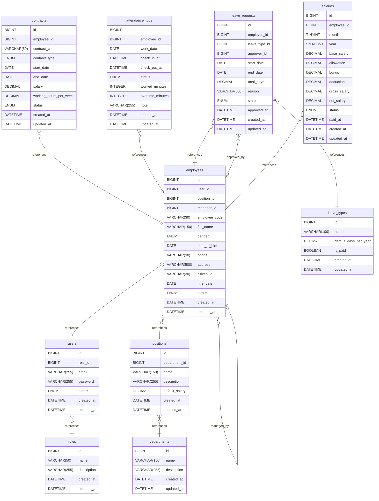

# Human Resource Management System documentation
## Summary

- [Introduction](#introduction)
- [Database Type](#database-type)
- [Table Structure](#table-structure)
	- [roles](#roles)
	- [users](#users)
	- [departments](#departments)
	- [positions](#positions)
	- [employees](#employees)
	- [contracts](#contracts)
	- [attendance_logs](#attendance_logs)
	- [leave_types](#leave_types)
	- [leave_requests](#leave_requests)
	- [salaries](#salaries)
- [Relationships](#relationships)
- [Database Diagram](#database-diagram)

## Introduction

## Database type

- **Database system:** MySQL
## Table structure

### roles
Vai trò trong hệ thống
| Name            | Type         | Settings                   | References | Note |
| --------------- | ------------ | -------------------------- | ---------- | ---- |
| **id**          | BIGINT       | 🔑 PK, null, autoincrement |            |      |
| **name**        | VARCHAR(50)  | not null, unique           |            |      |
| **description** | VARCHAR(255) | nullable                   |            |      |
| **created_at**  | DATETIME     | not null, default: CURRENT_TIMESTAMP |            |      |
| **updated_at**  | DATETIME     | not null, default: CURRENT_TIMESTAMP |            |      | 

### users
Tài khoản người dùng
| Name              | Type         | Settings                             | References | Note |
| ----------------- | ------------ | ------------------------------------ | ---------- | ---- |
| **id**            | BIGINT       | 🔑 PK, null, autoincrement           |            |      |
| **role_id**       | BIGINT       | not null                             | roles.id   |      |
| **email**         | VARCHAR(255) | not null, unique                     |            |      |
| **password**      | VARCHAR(255) | not null                             |            | Dùng theo chuẩn Laravel Auth |
| **status**        | ENUM         | not null, default: active            |            |      |
| **created_at**    | DATETIME     | not null, default: CURRENT_TIMESTAMP |            |      |
| **updated_at**    | DATETIME     | not null, default: CURRENT_TIMESTAMP |            |      | 

#### Enums
##### status

- active
- locked

#### Indexes
| Name           | Unique | Fields  |
| -------------- | ------ | ------- |
| idx_users_role |        | role_id |
### departments
Phòng ban trong công ty
| Name            | Type         | Settings                             | References | Note |
| --------------- | ------------ | ------------------------------------ | ---------- | ---- |
| **id**          | BIGINT       | 🔑 PK, null, autoincrement           |            |      |
| **name**        | VARCHAR(150) | not null, unique                     |            |      |
| **description** | VARCHAR(255) | nullable                             |            |      |
| **created_at**  | DATETIME     | not null, default: CURRENT_TIMESTAMP |            |      |
| **updated_at**  | DATETIME     | not null, default: CURRENT_TIMESTAMP |            |      | 

### positions
Chức vụ/Vị trí công việc
| Name               | Type          | Settings                             | References | Note |
| ------------------ | ------------- | ------------------------------------ | ---------- | ---- |
| **id**             | BIGINT        | 🔑 PK, null, autoincrement           |            |      |
| **department_id**  | BIGINT        | not null                             | departments.id |      |
| **name**           | VARCHAR(150)  | not null                             |            |      |
| **description**    | VARCHAR(255)  | nullable                             |            |      |
| **default_salary** | DECIMAL(15,2) | not null, default: 0                 |            |      |
| **created_at**     | DATETIME      | not null, default: CURRENT_TIMESTAMP |            |      |
| **updated_at**     | DATETIME      | not null, default: CURRENT_TIMESTAMP |            |      | 

#### Indexes
| Name                     | Unique | Fields        |
| ------------------------ | ------ | ------------- |
| uq_positions_department_name | ✅ | department_id, name |
| idx_positions_department |        | department_id |
### employees
Hồ sơ nhân viên
| Name              | Type         | Settings                             | References | Note |
| ----------------- | ------------ | ------------------------------------ | ---------- | ---- |
| **id**            | BIGINT       | 🔑 PK, null, autoincrement           |            |      |
| **user_id**       | BIGINT       | not null, unique                     | users.id   |      |
| **position_id**   | BIGINT       | not null                             | positions.id |      |
| **manager_id**    | BIGINT       | nullable                             | employees.id | Quản lý trực tiếp, có thể null |
| **employee_code** | VARCHAR(30)  | not null, unique                     |            |      |
| **full_name**     | VARCHAR(150) | not null                             |            |      |
| **gender**        | ENUM         | not null                             |            |      |
| **date_of_birth** | DATE         | not null                             |            |      |
| **phone**         | VARCHAR(30)  | not null                             |            |      |
| **address**       | VARCHAR(500) | not null                             |            |      |
| **citizen_id**    | VARCHAR(30)  | not null, unique                     |            |      |
| **hire_date**     | DATE         | not null                             |            |      |
| **status**        | ENUM         | not null, default: probation         |            |      |
| **created_at**    | DATETIME     | not null, default: CURRENT_TIMESTAMP |            |      |
| **updated_at**    | DATETIME     | not null, default: CURRENT_TIMESTAMP |            |      | 

#### Enums
##### gender

- male
- female
- other
##### status

- probation
- active
- resigned

#### Indexes
| Name                   | Unique | Fields      |
| ---------------------- | ------ | ----------- |
| idx_employees_position |        | position_id |
| idx_employees_manager  |        | manager_id  |
### contracts
Hợp đồng lao động
| Name                       | Type          | Settings                             | References | Note |
| -------------------------- | ------------- | ------------------------------------ | ---------- | ---- |
| **id**                     | BIGINT        | 🔑 PK, null, autoincrement           |            |      |
| **employee_id**            | BIGINT        | not null                             | employees.id |      |
| **contract_code**          | VARCHAR(50)   | not null, unique                     |            |      |
| **contract_type**          | ENUM          | not null                             |            |      |
| **start_date**             | DATE          | not null                             |            |      |
| **end_date**               | DATE          | null                                 |            |      |
| **salary**                 | DECIMAL(15,2) | not null, default: 0                 |            |      |
| **working_hours_per_week** | DECIMAL(5,2)  | not null, default: 40                |            |      |
| **status**                 | ENUM          | not null, default: active            |            |      |
| **created_at**             | DATETIME      | not null, default: CURRENT_TIMESTAMP |            |      |
| **updated_at**             | DATETIME      | not null, default: CURRENT_TIMESTAMP |            |      | 

#### Enums
##### contract_type

- probation
- fixed_term
- indefinite
##### status

- active
- expired
- terminated

### attendance_logs
Lịch sử chấm công
| Name                 | Type         | Settings                             | References | Note |
| -------------------- | ------------ | ------------------------------------ | ---------- | ---- |
| **id**               | BIGINT       | 🔑 PK, null, autoincrement           |            |      |
| **employee_id**      | BIGINT       | not null                             | employees.id |      |
| **work_date**        | DATE         | not null                             |            |      |
| **check_in_at**      | DATETIME     | nullable                             |            | Null khi vắng hoặc nghỉ phép |
| **check_out_at**     | DATETIME     | null                                 |            |      |
| **status**           | ENUM         | not null, default: present           |            |      |
| **worked_minutes**   | INTEGER      | not null, default: 0                 |            |      |
| **overtime_minutes** | INTEGER      | not null, default: 0                 |            |      |
| **note**             | VARCHAR(255) | nullable                             |            |      |
| **created_at**       | DATETIME     | not null, default: CURRENT_TIMESTAMP |            |      |
| **updated_at**       | DATETIME     | not null, default: CURRENT_TIMESTAMP |            |      | 

#### Enums
##### status

- present
- late
- absent
- leave

#### Indexes
| Name                     | Unique | Fields    |
| ------------------------ | ------ | --------- |
| uq_attendance_employee_date | ✅ | employee_id, work_date |
| idx_attendance_work_date |        | work_date |
### leave_types
Các loại nghỉ phép
| Name                      | Type         | Settings                   | References | Note |
| ------------------------- | ------------ | -------------------------- | ---------- | ---- |
| **id**                    | BIGINT       | 🔑 PK, null, autoincrement |            |      |
| **name**                  | VARCHAR(100) | not null, unique           |            |      |
| **default_days_per_year** | DECIMAL(5,2) | not null, default: 0       |            |      |
| **is_paid**               | BOOLEAN      | not null, default: true    |            |      |
| **created_at**            | DATETIME     | not null, default: CURRENT_TIMESTAMP |            |      |
| **updated_at**            | DATETIME     | not null, default: CURRENT_TIMESTAMP |            |      | 

### leave_requests
Lưu trữ đơn xin nghỉ phép
| Name              | Type         | Settings                             | References | Note |
| ----------------- | ------------ | ------------------------------------ | ---------- | ---- |
| **id**            | BIGINT       | 🔑 PK, null, autoincrement           |            |      |
| **employee_id**   | BIGINT       | not null                             | employees.id | Nhân viên gửi đơn |
| **leave_type_id** | BIGINT       | not null                             | leave_types.id |      |
| **approver_id**   | BIGINT       | nullable                             | employees.id | Người duyệt, null khi chưa duyệt |
| **start_date**    | DATE         | not null                             |            |      |
| **end_date**      | DATE         | not null                             |            |      |
| **total_days**    | DECIMAL(5,2) | not null, default: 1                 |            |      |
| **reason**        | VARCHAR(500) | not null                             |            |      |
| **status**        | ENUM         | not null, default: pending           |            |      |
| **approved_at**   | DATETIME     | null                                 |            |      |
| **created_at**    | DATETIME     | not null, default: CURRENT_TIMESTAMP |            |      |
| **updated_at**    | DATETIME     | not null, default: CURRENT_TIMESTAMP |            |      | 

#### Enums
##### status

- pending
- approved
- rejected
- cancelled

#### Indexes
| Name             | Unique | Fields        |
| ---------------- | ------ | ------------- |
| idx_leave_employee_status |        | employee_id, status |
| idx_leave_approver_status |        | approver_id, status |
| idx_leave_type   |        | leave_type_id |
| idx_leave_status |        | status        |
### salaries
Lưu bảng lương theo tháng của nhân viên
| Name             | Type          | Settings                             | References | Note |
| ---------------- | ------------- | ------------------------------------ | ---------- | ---- |
| **id**           | BIGINT        | 🔑 PK, null, autoincrement           |            |      |
| **employee_id**  | BIGINT        | not null                             | employees.id |      |
| **month**        | TINYINT       | not null                             |            |      |
| **year**         | SMALLINT      | not null                             |            |      |
| **base_salary**  | DECIMAL(15,2) | not null, default: 0                 |            |      |
| **allowance**    | DECIMAL(15,2) | not null, default: 0                 |            |      |
| **bonus**        | DECIMAL(15,2) | not null, default: 0                 |            |      |
| **deduction**    | DECIMAL(15,2) | not null, default: 0                 |            |      |
| **gross_salary** | DECIMAL(15,2) | not null, default: 0                 |            |      |
| **net_salary**   | DECIMAL(15,2) | not null, default: 0                 |            |      |
| **status**       | ENUM          | not null, default: draft             |            |      |
| **paid_at**      | DATETIME      | null                                 |            |      |
| **created_at**   | DATETIME      | not null, default: CURRENT_TIMESTAMP |            |      |
| **updated_at**   | DATETIME      | not null, default: CURRENT_TIMESTAMP |            |      | 

#### Enums
##### status

- draft
- paid

#### Indexes
| Name                  | Unique | Fields      |
| --------------------- | ------ | ----------- |
| uq_salary_employee_month_year | ✅ | employee_id, month, year |
| idx_salary_month_year |        | month, year |
## Relationships

- **users to roles**: many_to_one
- **positions to departments**: many_to_one
- **employees to users**: one_to_one
- **employees to positions**: many_to_one
- **employees to managers**: many_to_one self reference
- **contracts to employees**: many_to_one
- **attendance_logs to employees**: many_to_one
- **leave_requests to employees**: many_to_one
- **leave_requests to leave_types**: many_to_one
- **leave_requests to approvers**: many_to_one
- **salaries to employees**: many_to_one

## Database Diagram

