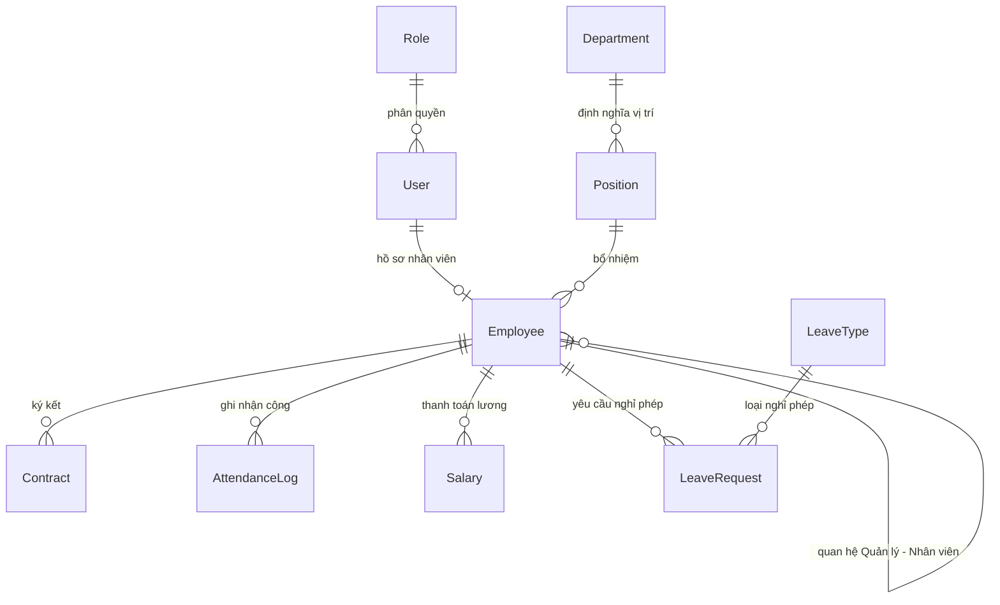

# Báo Cáo Nghiên Cứu Chuyên Sâu & Phân Tích Khoảng Trống (Gap Analysis) Hệ Thống HRM

Báo cáo này nghiên cứu kiến trúc của các hệ thống quản trị nhân sự nguồn mở phổ biến (**OrangeHRM**, **IceHRM**, **Sentrifugo**) và đối chiếu chi tiết với codebase Laravel HRM hiện tại. Mục tiêu là phát hiện các khoảng trống tính năng, lỗi logic nghiệp vụ thực tế, và các lỗ hổng bảo mật nghiêm trọng của hệ thống hiện tại, từ đó đề xuất phương án cải tiến toàn diện.

---

## 1. So Sánh Kiến Trúc Hệ Thống HRM

| Thành Phần Kiến Trúc | OrangeHRM (Symfony/Modular) | IceHRM (Slim/Angular REST-first) | Sentrifugo (Monolithic MVC) | Hệ Thống HRM Hiện Tại (Laravel 11) |
| :--- | :--- | :--- | :--- | :--- |
| **Kiến Trúc Tổng Quan** | Hybrid Symfony Bundle. Giao diện React/Vue giao tiếp qua REST API nội bộ. | Tách biệt hoàn toàn (SPA Frontend giao tiếp RESTful API Backend qua JWT). | Monolithic Zend Framework 1.x, MVC truyền thống, logic nằm sâu ở Controller. | Laravel 11 MVC truyền thống, sử dụng Blade template kết hợp Session. |
| **Mô Hình Mở Rộng** | **Cao**: Hệ thống Bundle/Plugin hỗ trợ hook/override linh hoạt. | **Trung bình**: Thư mục `extensions/` cho phép bật/tắt module độc lập. | **Thấp**: Codebase monolithic, sửa đổi yêu cầu can thiệp sâu vào controller lõi. | **Thấp**: Monolithic, phân hệ chức năng viết chung trong AdminHrmController. |
| **Lớp Truy Cập Dữ Liệu** | Doctrine ORM kết hợp raw PDO cho các câu lệnh nặng. | Custom ORM/Active Record. | Zend_Db raw SQL adapters, không có ORM thực sự. | Eloquent ORM. |
| **Mô Hình Phân Quyền** | Matrix RBAC/ACL. Phân quyền chi tiết theo Nhóm dữ liệu (Data Groups) và Cấp dưới. | REST API ACL kết hợp phân quyền theo cấu trúc phòng ban/vai trò. | Phân quyền tĩnh theo Role, phân công Head of Department trực tiếp trong DB. | Custom Session-based Middleware (`RequireSessionRole`), lưu quyền tĩnh trong session. |

---

## 2. Bản Đồ Thực Thể CSDL & Giao Điểm Ràng Buộc

Mô hình dữ liệu của một hệ thống HRM chuẩn nghiệp vụ đòi hỏi sự chuẩn hóa cao để tránh các lỗi dị thường (data anomalies) như chấm công mồ côi hoặc sai lệch quỹ phép.



### So Sánh Schema Giữa Công Nghệ Chuẩn và Hệ Thống Hiện Tại

1.  **Phân Hệ Nghỉ Phép (Leave Management)**
    *   **Chuẩn Công Nghiệp (OrangeHRM / IceHRM):** Phân chia rõ ràng giữa Loại phép (`leave_types`), Hạn mức phép năm (`leave_entitlements`), Đơn xin phép (`leave_requests`) và Chi tiết ngày nghỉ cụ thể (`leaves`).
    *   **Hệ Thống Hiện Tại:** Tồn tại hai cấu trúc song song. Bảng mới (`leave_requests`, `leave_types`) được định nghĩa trong Migration nhưng **bỏ hoang**. Hệ thống thực tế chạy hoàn toàn trên bảng `leaves` cũ (lưu `emp_id` dạng String, `leave_type` dạng String cứng).
2.  **Phân Hệ Chấm Công (Time & Attendance)**
    *   **Chuẩn Công Nghiệp:** Lưu trữ mọi timestamp theo giờ chuẩn UTC. Tích hợp Geofencing qua tọa độ GPS (Haversine Formula) và dải IP Subnet được phép để ngăn chặn chấm công giả mạo (Buddy Punching).
    *   **Hệ Thống Hiện Tại:** Không lưu tọa độ hay IP. Chấm công hoàn toàn dựa trên thời gian thực tế của server (dễ bị lệch múi giờ nếu server đặt ở khu vực khác).

---

## 3. Phân Tích Khoảng Trống Nghiệp Vụ (Business Logic Gaps)

Sau khi đối chiếu chi tiết luồng code thực tế, hệ thống hiện tại bộc lộ những lỗi logic nghiệp vụ nghiêm trọng có thể làm sai lệch dữ liệu tài chính và hoạt động của doanh nghiệp:

### A. Lỗi Lệch Ngày Chấm Công Do Múi Giờ UTC Làm Hỏng Luồng Check-out
*   **Mô tả:** Laravel mặc định cấu hình múi giờ là UTC. Tại Việt Nam (UTC+7), khi nhân viên ca sáng check-in lúc **06:30 sáng** (giờ địa phương), giờ server ghi nhận sẽ là **23:30 đêm ngày hôm trước** (UTC). Hàm `checkIn()` lưu ngày làm việc `work_date = 'YYYY-MM-DD'` theo ngày hôm trước.
*   **Hậu quả:** Khi nhân viên bấm check-out lúc **17:30 chiều** cùng ngày (UTC là 10:30 sáng), hàm `checkOut()` sẽ truy vấn bản ghi check-in của ngày hôm nay bằng `Carbon::today()->toDateString()`. Hệ thống sẽ báo lỗi `"Bạn cần phải check-in trước khi check-out!"` vì check-in thực tế đã bị ghi nhận vào ngày hôm trước.
*   **Giải pháp:** Đồng bộ hóa múi giờ hệ thống trong `config/app.php` sang `'Asia/Ho_Chi_Minh'` hoặc chỉ định timezone rõ ràng khi khởi tạo đối tượng thời gian: `Carbon::today('Asia/Ho_Chi_Minh')->toDateString()`.

### B. Tính Sai Giờ Làm Việc Thực Tế (OT Ảo Do Không Khấu Trừ Giờ Nghỉ Trưa)
*   **Mô tả:** Hàm `checkOut()` tính tổng thời gian bằng `diffInMinutes(checkIn)` và tự động đẩy phần thừa trên 8 tiếng (480 phút) vào overtime (`overtime_minutes`).
*   **Hậu quả:** Một ngày làm việc hành chính từ 08:00 đến 17:00 kéo dài 9 tiếng (540 phút), bao gồm **1 tiếng nghỉ trưa không lương**. Hệ thống hiện tại sẽ tính `$totalMinutes = 540`, gán `worked_minutes = 480` và **tính dư 60 phút tăng ca (OT)** cho nhân viên dù họ chỉ làm việc bình thường. Điều này gây thất thoát quỹ lương nghiêm trọng cho doanh nghiệp.
*   **Giải pháp:** Khấu trừ thời gian nghỉ trưa cố định (ví dụ: 60 phút) khi tính toán khoảng thời gian làm việc nếu phiên làm việc bao phủ khung giờ trưa (12:00 - 13:00).

### C. Logic Chốt Công (Finalize) Gây Lockout Nhân Viên Đi Muộn
*   **Mô tả:** Hàm `finalizeAttendance()` quét toàn bộ nhân viên chưa chấm công trong ngày hiện tại (`date('Y-m-d')`) để tự động tạo bản ghi vắng mặt (`absent`) hoặc nghỉ phép (`leave`).
*   **Hậu quả:** Nếu Admin thực hiện chốt công vào lúc 09:00 sáng cho ngày hôm nay, bất kỳ nhân viên nào đi muộn (ví dụ đến lúc 09:30) sẽ bị hệ thống tự động đánh dấu là `absent`. Khi họ đến nơi và bấm Check-in, hệ thống sẽ chặn lại vì bản ghi chấm công ngày hôm đó đã tồn tại, hoặc gây ra lỗi hệ thống 500 (SQL QueryException do trùng lặp khóa duy nhất).
*   **Giải pháp:** Ràng buộc điều kiện chốt công chỉ áp dụng cho **các ngày trong quá khứ** (`work_date < Carbon::today()`), hoặc chỉ cho phép chạy cuối ngày (sau 18:00).

### D. Tính Số Ngày Nghỉ Phép Bao Gồm Cả Ngày Cuối Tuần
*   **Mô tả:** Hàm `LeaveController@store` tính số ngày nghỉ bằng cách lấy khoảng cách ngày đơn giản: `$days = $start->diffInDays($end) + 1;`.
*   **Hậu quả:** Nếu nhân viên xin nghỉ từ thứ Sáu đến thứ Hai tuần sau, hệ thống tính tổng số ngày nghỉ là **4 ngày** (bao gồm thứ Bảy và Chủ Nhật) và trừ thẳng vào hạn mức phép năm, gây thiệt hại quyền lợi của người lao động.
*   **Giải pháp:** Viết hàm helper đếm số ngày nghỉ thực tế bằng cách duyệt qua từng ngày và loại bỏ ngày cuối tuần (`$date->isWeekend()`) và ngày lễ quốc gia.

### E. Lệch Pha Trạng Thái Hợp Đồng Lao Động Giữa DB Và Model View
*   **Mô tả:** Model `Contract.php` có thuộc tính động `getEffectiveStatusAttribute()` để kiểm tra hợp đồng hết hạn (`expired`). Tuy nhiên, cột `status` thực tế trong database vẫn lưu giá trị gốc là `'active'`.
*   **Hậu quả:** Câu lệnh SQL trên trang Dashboard thống kê số hợp đồng đang hoạt động bằng query thô: `Contract::where('status', 'active')->count()`. Điều này khiến các hợp đồng đã quá hạn vẫn được đếm là đang hoạt động, gây nhiễu dữ liệu quản trị.
*   **Giải pháp:** Cập nhật trạng thái hợp đồng trong DB thông qua một tiến trình lập lịch (Cron Job / Laravel Scheduler) chạy hàng ngày, hoặc tối ưu hóa câu truy vấn Dashboard để loại trừ các hợp đồng đã quá ngày kết thúc (`end_date < today`).

---

## 4. Phân Tích Khoảng Trống Bảo Mật & Kiểm Soát Nội Bộ

Kiểm soát nội bộ (Internal Control) là yếu tố sống còn của một hệ thống quản lý doanh nghiệp. Codebase hiện tại bộc lộ nhiều lỗ hổng phân quyền nghiêm trọng:

### A. Lỗ Hổng Vô Hiệu Hóa Tài Khoản Trễ (Session Status Sync Bypass)
*   **Lỗ hổng:** Middleware phân quyền `RequireSessionRole` kiểm tra quyền hạn của người dùng hoàn toàn dựa trên dữ liệu lưu trong session (`user_id`, `user_role`).
*   **Hậu quả:** Khi Admin khóa tài khoản của một nhân viên (`status = 'locked'`) hoặc sa thải họ (`status = 'resigned'`), phiên đăng nhập (session) của nhân viên đó vẫn hoạt động bình thường. Họ tiếp tục truy cập và thao tác dữ liệu nhạy cảm cho đến khi session tự hết hạn hoặc bị xóa thủ công.
*   **Giải pháp:** Trong middleware `RequireSessionRole`, cần thực hiện truy vấn cơ sở dữ liệu để xác thực trạng thái tài khoản của người dùng trên mỗi request:
    ```php
    $user = \App\Models\User::find($request->session()->get('user_id'));
    if (!$user || $user->status === 'locked') {
        $request->session()->invalidate();
        return redirect()->route('login')->withErrors(['email' => 'Tài khoản đã bị khóa!']);
    }
    ```

### B. Lỗ Hổng Tự Phê Duyệt Đơn Phép (Self-Approval Bypass)
*   **Lỗ hổng:** Các route duyệt đơn phép `/admin/leaves/approve/{id}` được bảo vệ bởi middleware `require.role:admin,hr`.
*   **Hậu quả:** Một nhân viên thuộc phòng nhân sự (có vai trò là `hr`) cũng có hồ sơ nhân viên trong hệ thống. Khi người này tự làm đơn xin nghỉ phép, họ có thể tự truy cập route duyệt phép để phê duyệt đơn của chính mình mà không cần sự thông qua của Admin. Điều này vi phạm nghiêm trọng nguyên tắc **Phân tách nhiệm vụ (Separation of Duties)**.
*   **Giải pháp:** Ràng buộc chặt chẽ trong Controller không cho phép người phê duyệt trùng với người làm đơn:
    ```php
    if ($leave->emp_id == session('user_id')) {
        return redirect()->back()->with('error', 'Bạn không thể tự phê duyệt đơn phép của mình!');
    }
    ```

### C. Cho Phép Xóa Đơn Nghỉ Phép Đã Được Duyệt (PTO Tampering)
*   **Lỗ hổng:** Hàm `destroy()` trong `LeaveController` cho phép nhân viên xóa bất kỳ bản ghi nghỉ phép nào thuộc quyền sở hữu của họ mà không kiểm tra trạng thái của đơn.
*   **Hậu quả:** Nhân viên có thể tạo đơn xin nghỉ phép, đợi Admin phê duyệt (`approved`), đi nghỉ xong quay lại hệ thống để **xóa** đơn phép đó. Vì quỹ phép năm thường được tính động bằng cách trừ đi tổng số ngày nghỉ đã được duyệt, việc xóa đơn đã duyệt sẽ reset số ngày phép của nhân viên về trạng thái ban đầu, cho phép họ nghỉ quá hạn mức quy định.
*   **Giải pháp:** Chỉ cho phép xóa đơn phép khi trạng thái đang là `'pending'` hoặc `'cancelled'`.

### D. Sửa Đổi Dữ Liệu Bảng Lương Đã Thanh Toán (Paid Payroll Tampering)
*   **Lỗ hổng:** Hàm `storeSalary` sử dụng `updateOrCreate` cho phép Admin ghi đè dữ liệu bảng lương bất kỳ lúc nào.
*   **Hậu quả:** Khi một bảng lương đã được chuyển sang trạng thái đã chi trả (`status = 'paid'`), nó phải được khóa lại để phục vụ kiểm toán tài chính. Việc cho phép Admin cập nhật đè số liệu lương cũ mà không có cơ chế lưu vết thay đổi sẽ gây rủi ro thất thoát tài chính lớn và không thể kiểm toán.
*   **Giải pháp:** Kiểm tra trạng thái của bản ghi lương, nếu trạng thái đã là `paid`, chặn mọi hành động chỉnh sửa thông tin.

### E. Lộ Thông Tin Nhạy Cảm Do Không Bắt Ngoại Lệ (Information Disclosure)
*   **Lỗ hổng:** Khi xảy ra lỗi trùng lặp dữ liệu (ví dụ: bấm check-in liên tiếp gây lỗi TOCTOU), hệ thống hiển thị trực tiếp trang lỗi 500 kèm theo chi tiết câu lệnh SQL, tên bảng và ràng buộc khóa ngoại của CSDL.
*   **Hậu quả:** Kẻ tấn công có thể lợi dụng thông tin cấu trúc cơ sở dữ liệu này để thiết kế các kịch bản tấn công SQL Injection hoặc leo thang đặc quyền.
*   **Giải pháp:** Sử dụng khối lệnh `try-catch` trong Controller để bắt các ngoại lệ hệ thống và trả về thông báo lỗi thân thiện, bảo mật.

---

## 5. Bất Nhất Quán Về Thiết Kế CSDL Trong Codebase

### A. Lỗi Ép Kiểu Ngầm Định (Implicit Type Conversion) Làm Chậm Hệ Thống
*   Cột `emp_id` trong bảng `leaves` cũ định nghĩa kiểu dữ liệu là `VARCHAR(255)` (String).
*   Trong khi đó, cột khóa chính liên kết của nhân viên là `employees.user_id` kiểu `BIGINT UNSIGNED` (Integer).
*   Khi thực hiện Join hoặc Eager Loading (`with('employee')`), MySQL bắt buộc phải chuyển đổi kiểu dữ liệu của toàn bộ các dòng trong bảng `leaves` từ String sang Integer. Việc này làm **vô hiệu hóa hoàn toàn Index** của cột khóa ngoại, dẫn đến việc quét toàn bộ bảng dữ liệu (Full Table Scan), gây nghẽn hệ thống nghiêm trọng khi số lượng bản ghi tăng lên hàng ngàn dòng.

### B. Admin Thiếu Bản Ghi Employee Tương Ứng Trong Seeder
*   Tệp `DatabaseSeeder.php` tạo tài khoản `admin@example.com` trong bảng `users` nhưng không tạo bản ghi thông tin nhân viên tương ứng trong bảng `employees`.
*   Điều này sẽ gây ra lỗi nghiêm trọng `Attempt to read property on null` tại các module dùng chung cần truy xuất hồ sơ nhân sự (ví dụ: hiển thị tên người duyệt phép, lưu vết audit logs thay đổi dữ liệu,...).

---

## 6. Lộ Trình Khuyến Nghị Cải Tiến Hệ Thống (Roadmap)

### Bước 1: Chuẩn Hóa Cơ Sở Dữ Liệu
*   Loại bỏ hoàn toàn bảng `leaves` cũ.
*   Chuyển toàn bộ logic xử lý đơn nghỉ phép sang bảng `leave_requests` mới đã được thiết kế chuẩn quan hệ khóa ngoại (kiểu `BIGINT UNSIGNED` trỏ tới `employees.id` và `leave_types.id`).

### Bước 2: Đồng Bộ Timezone Và Khấu Trừ Giờ Nghỉ Trưa
*   Cấu hình `timezone => 'Asia/Ho_Chi_Minh'` trong Laravel config.
*   Cập nhật thuật toán tính giờ làm việc trong `AttendanceController`:
    $$\text{Giờ làm thực tế} = \text{Tổng thời gian Check-in/out} - \text{Thời gian nghỉ trưa (60 phút)}$$

### Bước 3: Vá Lỗ Hổng Bảo Mật Middleware
*   Truy vấn trực tiếp DB trong `RequireSessionRole` để kiểm tra thuộc tính `status` của User. Nếu người dùng bị khóa (`status = 'locked'`), lập tức hủy session (`session()->invalidate()`) và đẩy ra trang đăng nhập.

### Bước 4: Thiết Lập Ràng Buộc Phê Duyệt Và Xóa Đơn
*   Ngăn chặn HR tự duyệt đơn phép của chính mình.
*   Chặn hành động xóa đơn nghỉ phép khi trạng thái đã chuyển sang `'approved'` hoặc `'rejected'`.
